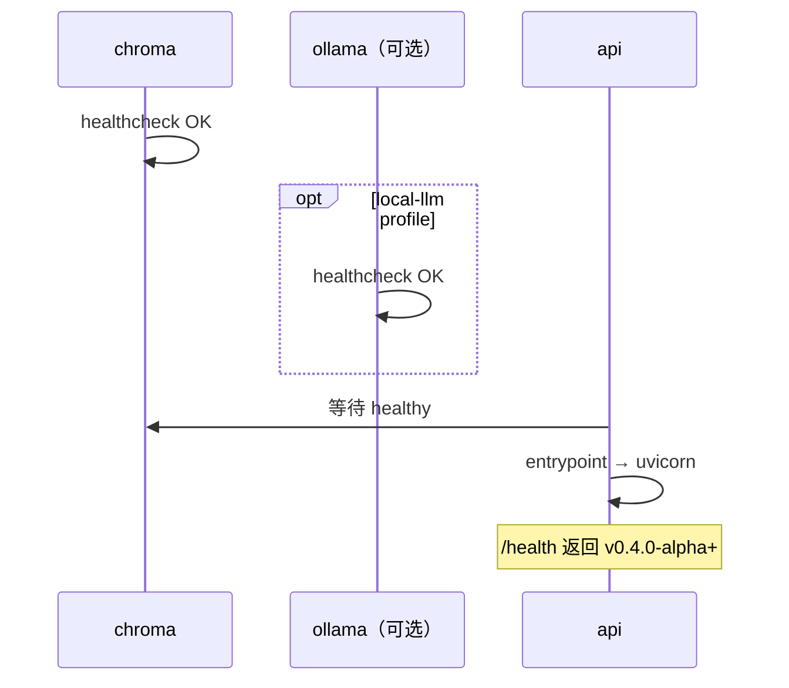

# Day22 — Docker Compose 设计与使用指南

> 版本：**v0.4-alpha** | 前置：**Day05 Dockerfile**、**Day12 Chroma**、**Day03 Ollama**  
> **定位：从「分别 docker run」到 `docker compose up` 一键启动完整本地栈**

## 学习目标

- [ ] 理解多容器编排与服务发现（Compose network）
- [ ] 掌握 FastAPI / Chroma Server / Ollama 的依赖关系与启动顺序
- [ ] 能区分「嵌入式 Chroma」与「Chroma Server」两种模式
- [ ] 能用一条命令拉起可演示的本地环境

---

## 今日边界（重要）

| 做 | 不做 |
|----|------|
| `docker-compose.yml` 编排 api + chroma（ollama/redis 为 profile） | Nginx 反代（Day23） |
| 数据卷持久化（uploads / chroma / ollama models） | 前端生产构建进镜像 |
| 健康检查 + `depends_on` 启动顺序 | Redis 业务接入（仅可选拉起） |
| `.env` / `compose` 环境变量对齐 | K8s / 云部署 |
| Chroma **Server 模式**适配（小改 `vector_store.py`） | CI/CD 流水线 |

**Day22 核心成果：** `docker compose up` 一键启动 **api + chroma**（默认通义 LLM）；`--profile local-llm` 可额外启用 Ollama。浏览器访问 `http://localhost:8000/health` 可用。

---

## 以前 vs 以后

### 以前（Day05 ~ Day21）

```powershell
# 终端 1：宿主机 Ollama
ollama serve

# 终端 2：宿主机 Python
python -m uvicorn app.main:app --reload

# Chroma：嵌入式，随 API 进程写在 data/chroma/
# 若强行容器化，需分别：
docker run ... fastapi
docker run ... chromadb/chroma      # 需改代码连 HttpClient
docker run ... ollama/ollama
```

问题：命令多、网络手工配置、端口/卷易漏、新人上手成本高。

### 以后（Day22）

```powershell
cp .env.example .env   # 按需改 Key / 模型名
docker compose up -d
docker compose ps
curl http://127.0.0.1:8000/health
```

一条命令拉起：**FastAPI · Chroma Server**；Ollama 与 Redis 通过 **profile** 按需启用。

---

## 使用指南

### 前置条件

| 项 | 说明 |
|----|------|
| Docker Desktop | 已安装，含 `docker compose` 命令 |
| `.env` | 项目根目录存在；通义 Key 等在 [阿里云百炼](https://bailian.console.aliyun.com/) 获取 |
| 端口 **8000** | 未被占用；若本机正在 `uvicorn --reload`，需先停止（与容器 api 冲突） |
| 网络 | 首次 `docker compose build` 需下载 Python 依赖（含 `torch`），请保持网络稳定 |

**`.env` 云端示例（方式一默认）：**

```env
OPENAI_API_KEY=你的API_KEY
OPENAI_BASE_URL=https://dashscope.aliyuncs.com/compatible-mode/v1
MODEL_NAME=qwen-plus
PROVIDER=dashscope
```

---

### 方式一：云端通义（默认，推荐）

启动 **`api` + `chroma`**，LLM 直接读取 `.env` 中的通义配置（如 `qwen-plus`），**不启动 Ollama**。

```powershell
cd E:\2026\learn\ai-project-assistant

# 若无 .env，从模板复制并填入 Key
cp .env.example .env

# 构建并后台启动（首次较慢）
docker compose up -d --build

# 查看状态（api、chroma 应为 healthy）
docker compose ps

# 探活
Invoke-RestMethod http://127.0.0.1:8000/health

# 试 Agent
Invoke-RestMethod -Uri http://127.0.0.1:8000/agent -Method Post `
  -ContentType "application/json" -Body '{"message":"你好"}'

# 试流式（SSE）
curl -N -X POST http://127.0.0.1:8000/agent/stream `
  -H "Content-Type: application/json" `
  -d '{"message":"北京天气怎么样"}'
```

**适用场景：** 已有通义 API Key、不想本地跑大模型、与当前宿主机开发配置一致。

---

### 方式二：本地 Ollama（`--profile local-llm`）

额外启动 **`ollama`** 容器；`scripts/docker-entrypoint.sh` 检测到网络内 Ollama 可达后，自动将 LLM 切换为 `http://ollama:11434/v1`。

```powershell
cd E:\2026\learn\ai-project-assistant

docker compose --profile local-llm up -d --build
docker compose ps

# 首次需拉取模型（与 .env 中 MODEL_NAME 一致，默认 qwen3:4b）
.\scripts\ollama-pull.ps1
# 或：docker compose exec ollama ollama pull qwen3:4b

Invoke-RestMethod http://127.0.0.1:8000/health

Invoke-RestMethod -Uri http://127.0.0.1:8000/agent -Method Post `
  -ContentType "application/json" -Body '{"message":"你好"}'
```

**日志确认 LLM 来源：**

```powershell
docker compose logs api | Select-String entrypoint
# 云端：[entrypoint] LLM: https://dashscope.aliyuncs.com/...
# 本地：[entrypoint] LLM: Ollama (local-llm profile)
```

**适用场景：** 离线演示、无云端 Key、与 Day03/Day04 本地 Ollama 链路一致。

---

### 前端联调（Day21_1 Web UI）

Compose **仅启动后端**；前端仍用 Vite 开发服务器，通过代理访问 `http://127.0.0.1:8000`。

```powershell
# 终端 1：后端（任选方式一或方式二）
docker compose up -d --build

# 终端 2：前端
cd frontend
npm install          # 首次
npm run dev
```

浏览器打开：**http://127.0.0.1:5173**

| 能力 | 说明 |
|------|------|
| 聊天 | `POST /agent/stream` SSE 流式输出 |
| 上传 PDF | `POST /upload`，文件写入挂载的 `./uploads` |
| Workflow / sources | 助手气泡下方 MetaBlock 展示 |
| 会话记忆 | `session_id` 存 localStorage |

> Vite 将 `/agent`、`/upload`、`/health` 代理到 `127.0.0.1:8000`；后端 CORS 已放行 `5173` 作为备用。  
> 生产同域部署留待 **Day23 Nginx**。

---

### 可选：Redis

```powershell
docker compose --profile redis up -d
# 或与其他 profile 组合：
docker compose --profile local-llm --profile redis up -d
```

Day22 仅拉起 Redis 容器，业务尚未接入；`REDIS_URL=redis://redis:6379/0` 预留给 Day24+。

---

### 知识库入库（RAG）

Compose 下 Chroma 为 **Server 模式**，向量存在 `chroma_data` volume；`data/chunks` 与 `data/vectors` 仍通过 `./data` 挂载与宿主机共享。

```powershell
# 1. 确保栈已启动
docker compose up -d

# 2. 宿主机执行入库（与 Day09~12 相同，写入挂载目录后由 api 容器内 Embedding 入库）
python -c "from app.rag.pdf_loader import parse_pdf; parse_pdf('uploads/test.pdf')"
python -c "from app.rag.chunker import chunk_pdf; chunk_pdf('data/parsed/test.json')"
python -c "from app.rag.embedder import embed_chunks; embed_chunks('data/chunks/test.json')"
python -c "from app.rag.vector_store import index_chunks; index_chunks('data/chunks/test.json')"

# 3. 验证 RAG
Invoke-RestMethod -Uri http://127.0.0.1:8000/rag -Method Post `
  -ContentType "application/json" -Body '{"question":"test.pdf 主要内容"}'
```

---

### 常用运维命令

| 操作 | 命令 |
|------|------|
| 查看 api 日志 | `docker compose logs -f api` |
| 查看全部日志 | `docker compose logs -f` |
| 重启 api | `docker compose restart api` |
| 停止栈 | `docker compose down` |
| 停止并删除数据卷 | `docker compose down -v`（**慎用**，会清空 chroma/ollama 模型缓存） |
| 仅重建 api 镜像 | `docker compose build api` |
| 进入 api 容器 | `docker compose exec api bash` |

---

### 宿主机开发（不用 Docker）

与 Compose **互斥占用 8000 端口**；适合改代码热重载：

```powershell
# 终端 1（可选）：本机 Ollama
ollama serve

# 终端 2：FastAPI
python -m uvicorn app.main:app --reload --host 127.0.0.1 --port 8000
```

此时 `CHROMA_MODE=embedded`（`.env` 默认），Chroma 数据在 `data/chroma/`，**不**走 Compose 内的 chroma 服务。

---

### 常见问题

| 现象 | 处理 |
|------|------|
| `build` 时 pip / Docker Hub 超时 | 网络恢复后重试 `docker compose build api` |
| `8000` 端口被占用 | 停止本机 `uvicorn` 或其他占端口进程 |
| Agent 报 LLM 不可用 | 方式一检查通义 Key；方式二确认已 `ollama pull` |
| RAG 无 sources | Compose 下需重新执行入库；嵌入式 `data/chroma` 与 volume 不互通 |
| Embedding 首次很慢 | 正常；`hf_cache` volume 会缓存 HuggingFace 模型 |
| MCP 读 README | Compose 默认 `MCP_ENABLED=false`；需在宿主机开发或自定义镜像 |

---

## 目标架构

```
                    ┌─────────────────────────────────────┐
                    │         docker compose network       │
                    │              (app-net)               │
                    │                                      │
  Browser ──:8000──►│  api (FastAPI)                       │
                    │    │                                 │
                    │    ├──► chroma:8000       (向量库)   │
                    │    ├──► 通义 API（默认，.env）        │
                    │    └──► ollama:11434 [profile]       │
                    │                                      │
                    │  [profile: redis]                    │
                    │    redis:6379          (可选，预留)   │
                    └─────────────────────────────────────┘
                              │
                    named volumes / bind mounts
                    ├── ollama_data
                    ├── chroma_data
                    └── ./data, ./uploads (bind)
```

### 服务清单

| 服务 | 镜像 | 容器端口 | 宿主机端口 | 说明 |
|------|------|----------|------------|------|
| `api` | 本地 `Dockerfile` build | 8000 | **8000** | FastAPI + Agent + RAG |
| `chroma` | `chromadb/chroma` | 8000 | 不暴露（仅内网） | 向量数据库 Server |
| `ollama` | `ollama/ollama` | 11434 | 11434 | 本地 LLM（`profile: local-llm`） |
| `redis` | `redis:7-alpine` | 6379 | 6379（可选） | 预留缓存 / 会话 |

> **端口说明：** Chroma 与 FastAPI 默认均为 8000。Compose 内通过服务名访问，**只将 `api:8000` 映射到宿主机**，`chroma` 仅在 `app-net` 内可达，避免冲突。

---

## 服务设计

### 1. `api` — FastAPI 应用

**构建：** 沿用根目录 `Dockerfile`（`python:3.13-slim` + `requirements.txt`）。

**环境变量：** 通过 `env_file: .env` 注入；Compose 仅覆盖 Chroma / MCP 等与栈相关的项：

```env
CHROMA_MODE=server
CHROMA_HOST=chroma
CHROMA_PORT=8000
MCP_ENABLED=false

# LLM 由 .env 提供（云端）或 entrypoint 在 local-llm 时自动切 Ollama
OPENAI_API_KEY=...
OPENAI_BASE_URL=https://dashscope.aliyuncs.com/compatible-mode/v1
MODEL_NAME=qwen-plus
```

**卷挂载：**

| 挂载 | 用途 |
|------|------|
| `./uploads:/app/uploads` | PDF 上传 |
| `./data:/app/data` | parsed / chunks / vectors / conversations |
| `hf_cache:/root/.cache/huggingface` | Embedding 模型缓存（避免每次重下） |

**健康检查：**

```yaml
healthcheck:
  test: ["CMD", "python", "-c", "import urllib.request; urllib.request.urlopen('http://127.0.0.1:8000/health')"]
  interval: 15s
  timeout: 5s
  retries: 3
  start_period: 40s
```

**依赖：** `chroma` healthy 后启动；`ollama` 为 `required: false`（仅 local-llm profile 时参与等待）。

**启动脚本：** `scripts/docker-entrypoint.sh` — 若 Compose 网络内 `ollama` 可达则覆盖 LLM 环境变量，否则沿用 `.env`。

---

### 2. `chroma` — Chroma Server

**镜像：** `chromadb/chroma:latest`（或固定 minor 版本 tag）。

**数据：** named volume `chroma_data` → `/chroma/chroma`。

**环境：**

```env
IS_PERSISTENT=TRUE
ANONYMIZED_TELEMETRY=FALSE
```

**健康检查：** `GET http://localhost:8000/api/v1/heartbeat`（以官方镜像实际路径为准）。

**与现有代码的关系：**

当前 `vector_store.py` 使用嵌入式客户端：

```python
chromadb.PersistentClient(path=str(CHROMA_DIR))
```

Day22 实现时需增加 **双模式**（改动面小）：

```python
# config.py
CHROMA_MODE = os.getenv("CHROMA_MODE", "embedded")  # embedded | server
CHROMA_HOST = os.getenv("CHROMA_HOST", "localhost")
CHROMA_PORT = int(os.getenv("CHROMA_PORT", "8000"))

# vector_store.py
def get_chroma_client():
    if CHROMA_MODE == "server":
        return chromadb.HttpClient(host=CHROMA_HOST, port=CHROMA_PORT)
    ensure_dir(CHROMA_DIR)
    return chromadb.PersistentClient(path=str(CHROMA_DIR))
```

- **本地开发**（`uvicorn --reload`）：默认 `embedded`，行为与 Day12 一致  
- **Compose 栈**：`CHROMA_MODE=server`，连 `chroma` 服务

---

### 3. `ollama` — 本地 LLM

**镜像：** `ollama/ollama:latest`

**数据：** named volume `ollama_data` → `/root/.ollama`

**端口：** `11434:11434`（便于宿主机 `ollama` CLI 调试；生产可去掉映射）

**模型拉取：** 首次启动需 `qwen3:4b`（或与 `.env` 中 `MODEL_NAME` 一致）。可选方案：

| 方案 | 说明 |
|------|------|
| A. 脚本（推荐） | `.\scripts\ollama-pull.ps1` 或 `docker compose exec ollama ollama pull qwen3:4b` |
| B. 手动 | 见方式二使用指南 |

**健康检查：** `curl -f http://localhost:11434/` 或 ollama API。

---

### 4. `redis` — 可选（Profile）

**启用：** `docker compose --profile redis up`

**用途（Day22 仅基础设施，不接业务）：**

| 未来场景 | Sprint |
|----------|--------|
| 会话 / 限流缓存 | Day24+ |
| Token 统计缓冲 | Day25 |
| 任务队列 | 更远期 |

**环境变量预留：** `REDIS_URL=redis://redis:6379/0`

---

## `docker-compose.yml` 要点（已实现）

- `ollama`：`profiles: ["local-llm"]`，默认不启动  
- `api`：`env_file: .env`，`depends_on.chroma` + `depends_on.ollama.required: false`  
- `chroma`：镜像 `chromadb/chroma:1.5.9`，数据卷 `chroma_data`  
- `redis`：`profiles: ["redis"]`  
- 详见项目根目录 `docker-compose.yml`

---

## 配置分层（双模式 LLM）

| 命令 | 启动服务 | LLM |
|------|----------|-----|
| `docker compose up` | `api` + `chroma` | `.env` 通义等云端（`qwen-plus`） |
| `docker compose --profile local-llm up` | `api` + `chroma` + `ollama` | `scripts/docker-entrypoint.sh` 自动切 `http://ollama:11434/v1` |
| 宿主机 `uvicorn --reload` | 本机进程 | `.env` + `CHROMA_MODE=embedded` |

`ollama` 服务带 `profiles: ["local-llm"]`，默认不启动。`api` 通过 `depends_on.ollama.required: false` 兼容两种模式。

---

## 数据与持久化

```
宿主机                          容器
├── uploads/          ◄──────  api:/app/uploads
├── data/
│   ├── parsed/       ◄──────  api:/app/data/parsed
│   ├── chunks/       ◄──────  api:/app/data/chunks
│   ├── vectors/      ◄──────  api:/app/data/vectors
│   └── conversations/◄──────  api:/app/data/conversations
├── chroma_data (volume) ◄───  chroma 服务（server 模式）
└── ollama_data (volume) ◄───  ollama 模型
```

**注意：** `CHROMA_MODE=server` 时，`data/chroma/` 目录不再由 API 写入，向量数据在 `chroma_data` volume。

**入库流程：** 见上文「知识库入库（RAG）」。

---

## 启动顺序



1. `chroma` 先 healthy  
2. 若 `--profile local-llm`，`ollama` 并行就绪  
3. `api` 启动；entrypoint 选择云端或 Ollama  
4. `POST /agent` / `POST /rag` 验证

---

## 与前端的关系

见上文 **「前端联调（Day21_1 Web UI）」**。Day23 将增加 Nginx 统一入口。

---

## 验收标准

- [x] `docker compose up -d` 启动 `api` + `chroma`（通义 LLM）
- [x] `docker compose --profile local-llm up -d` 额外启动 `ollama`
- [x] `GET http://localhost:8000/health` 返回版本号
- [ ] `POST /agent` 云端 / 本地均返回答案（本地需 `ollama pull`）
- [ ] 入库后 `POST /rag` 返回 `sources`
- [x] `docker compose down` 后再 `up`，volume 数据仍在
- [x] `docker compose --profile redis up` 可启动 Redis
- [x] 宿主机 `uvicorn` + `CHROMA_MODE=embedded` 不受影响
- [x] 前端 `npm run dev` 可联调 Compose 后端

---

## 已实现文件（Day22）

| 文件 | 说明 |
|------|------|
| `docker-compose.yml` | api + chroma + ollama(profile) + redis(profile) |
| `scripts/docker-entrypoint.sh` | 双模式 LLM 自动切换 |
| `scripts/ollama-pull.ps1` / `ollama-pull.sh` | 拉取 Ollama 模型 |
| `app/core/config.py` | `CHROMA_MODE` / `CHROMA_HOST` / `CHROMA_PORT` / `REDIS_URL` |
| `app/rag/vector_store.py` | `HttpClient` 双模式 |
| `.env.example` | Compose 与双模式说明 |
| `README.md` | Quick Start |
| `docs/Day22.md` | 设计 + 使用指南（本文） |

---

## 风险与对策

| 风险 | 对策 |
|------|------|
| Embedding 首次下载慢 | `hf_cache` volume；README 注明等待时间 |
| Ollama 模型未 pull | 启动后文档/脚本显式 `ollama pull` |
| Chroma 镜像 API 变更 | 固定镜像 tag，heartbeat 路径实现时验证 |
| 镜像体积大（sentence-transformers） | Day22 接受；后续多阶段构建优化 |
| Windows 路径 / 卷权限 | 使用相对路径 `./data`；与 Day05 `host.docker.internal` 文档并存 |
| MCP 需 Node | Compose 默认 `MCP_ENABLED=false`；MCP 仍在宿主机开发 |

---

## 快速命令索引

```powershell
# 方式一：云端通义
docker compose up -d --build

# 方式二：本地 Ollama
docker compose --profile local-llm up -d --build
.\scripts\ollama-pull.ps1

# 前端
cd frontend; npm run dev

# 探活 / Agent
Invoke-RestMethod http://127.0.0.1:8000/health
Invoke-RestMethod -Uri http://127.0.0.1:8000/agent -Method Post `
  -ContentType "application/json" -Body '{"message":"你好"}'

# 停止
docker compose down
```

---

## 小结

Day22 把分散的容器启动收敛为 **`docker compose up`**：默认 **通义云端 LLM + Chroma Server**；`--profile local-llm` 可切换 **Ollama**。配合 **前端 Vite 联调** 与 volume 持久化，项目具备「一条命令跑起来」的部署雏形，为 Day23 Nginx 反代打下基础。
