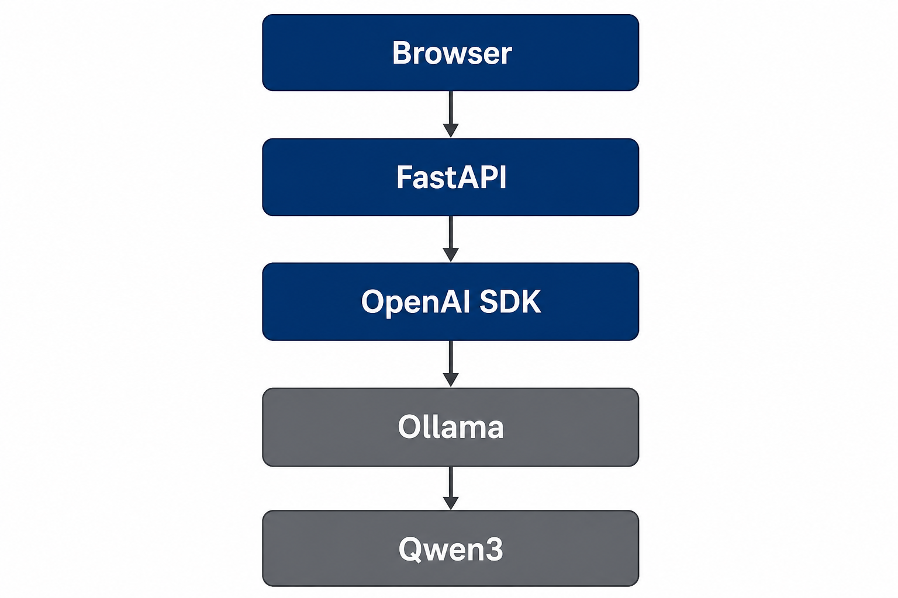

# AI Solution Design

> 本文档是 **AI Project Assistant** 的方案设计雏形，记录关键技术选型理由与后续演进方向。  
> 随项目迭代持续更新。

---

## 1. 项目背景

### 1.1 业务目标

构建一个可渐进演进的 AI 助手后端，支撑从「单轮问答」到「知识库问答」「工具调用」「多 Agent 协作」的完整能力链路。当前阶段聚焦 **LLM 接入与 API 化**，为后续 RAG、Agent、MCP 等能力预留统一接口层。

### 1.2 现状与约束

| 维度 | 现状 |
|------|------|
| 用户场景 | 学习 / 原型验证为主，需快速迭代 |
| 部署环境 | 本地开发 + Docker 容器，兼顾云端 API |
| 团队规模 | 小团队 / 个人，优先降低学习与维护成本 |
| 模型策略 | 开发用本地 Ollama，生产可切换云端通义千问 |

### 1.3 设计原则

1. **接口统一**：上层业务不感知底层模型提供方（Ollama / DashScope / OpenAI）
2. **分层清晰**：配置、模型调用、HTTP 路由各自独立，便于替换与测试
3. **渐进演进**：先跑通最小可用链路，再按需叠加 RAG、Agent、MCP
4. **可观测**：预留健康检查、模型信息查询等运维接口

---

## 2. 架构概览

### 2.1 请求链路（结构图）

**聊天链路：**

```
                    Browser
                       │
                    FastAPI
                       │
                  OpenAI SDK
                       │
                     Ollama
                       │
                      Qwen3
```

**文档解析与 RAG 链路（v0.2.0 · Day09~13）：**

```
              uploads/xxx.pdf
                     │
                     ▼
            app/rag/pdf_loader.py  →  data/parsed/xxx.json
                     │
                     ▼
            app/rag/chunker.py     →  data/chunks/xxx.json
                     │
                     ▼
            app/rag/embedder.py    →  data/vectors/xxx.json
                     │
                     ▼
            app/rag/vector_store.py → data/chroma/
                     │
         Question → search() → Top-K chunks
                     │
                     ▼
            app/rag/rag_pipeline.py → Prompt → LLM
                     │
                     ▼
              Answer + sources
```



| 层级 | 组件 | 说明 |
|------|------|------|
| 摄入层 | uploads/ | Day08 原始 PDF 存储 |
| 解析层 | pdf_loader | Day09 PyMuPDF 按页提取 |
| 切分层 | chunker | Day10 LangChain 文本切块 |
| 向量层 | embedder | Day11 bge-small / 通义 Embedding |
| 存储层 | vector_store | Day12 Chroma 持久化 + Top-K 检索 |
| 编排层 | rag_pipeline | Day13 检索结果 → Prompt → 带来源回答 |
| 网关层 | FastAPI | HTTP 路由、请求校验、响应封装 |
| 客户端层 | OpenAI SDK | 统一 Chat Completions 调用方式 |
| 推理层 | Ollama | 本地模型运行时，暴露 `/v1` 兼容端点 |
| 模型层 | Qwen3 | 实际执行推理的大语言模型（如 `qwen3:4b`） |

### 2.2 模块分层

```
┌─────────────┐     HTTP      ┌─────────────┐     OpenAI Compatible API     ┌─────────────┐
│   Client    │ ────────────► │   FastAPI   │ ─────────────────────────────► │   Ollama    │
│ (CLI / Web) │               │   (app.py)  │                               │   + Qwen3   │
└─────────────┘               └──────┬──────┘                               └─────────────┘
                                     │
                              ┌──────┴──────┐
                              │   llm.py    │  ← 模型调用封装
                              │  config.py  │  ← 环境配置
                              │  models.py  │  ← 请求/响应契约
                              └─────────────┘
```

当前实现：`Browser → FastAPI → OpenAI SDK → Ollama → Qwen3`

---

## 3. 技术选型

### 3.1 为什么选择 FastAPI

| 考量 | 说明 |
|------|------|
| 开发效率 | 基于 Python 类型注解，自动生成 OpenAPI 文档（`/docs`） |
| 数据校验 | 原生集成 Pydantic，请求/响应契约清晰，减少接口联调成本 |
| 性能 | 基于 ASGI（Uvicorn），异步友好，满足后续流式 SSE 扩展 |
| 生态 | 与 Python AI 栈（OpenAI SDK、LangChain 等）无缝衔接 |
| 运维 | 内置健康检查路由，便于 K8s / Docker 探活 |

**结论**：FastAPI 适合作为 AI 服务的 HTTP 网关层，在原型期与生产期均能保持较低迁移成本。

### 3.2 为什么选择 Ollama

| 考量 | 说明 |
|------|------|
| 本地优先 | 无需 API Key，离线可开发，降低学习门槛 |
| 一键部署 | `ollama pull` + `ollama serve` 即可运行开源模型 |
| 成本可控 | 开发/调试阶段无 Token 费用，适合高频实验 |
| 模型灵活 | 支持 qwen、llama 等多种模型，便于对比评测 |
| OpenAI 兼容 | 提供 `/v1` 端点，与云端 API 调用方式一致 |

**结论**：Ollama 作为本地默认推理引擎；生产环境通过切换 `OPENAI_BASE_URL` 即可迁移至云端，无需改动业务代码。

### 3.3 为什么采用 OpenAI Compatible API

OpenAI Chat Completions API 已成为事实上的 **行业标准接口形态**：

```
POST /v1/chat/completions
{
  "model": "qwen3:4b",
  "messages": [
    {"role": "system", "content": "..."},
    {"role": "user", "content": "..."}
  ]
}
```

| 优势 | 说明 |
|------|------|
| 统一 SDK | 一套 `openai` 客户端同时对接 Ollama、通义千问、OpenAI |
| 切换成本低 | 修改 `base_url` + `api_key` 即可切换提供方 |
| 生态兼容 | LangChain、LlamaIndex、Cursor MCP 等均以此为基础 |
| 未来扩展 | Tool Calling、Streaming、Embeddings 均有对应标准端点 |

本项目在 `llm.py` 中封装 `chat()`，上层仅传入 `message` 字符串；后续扩展流式、工具调用时，仍可在同一客户端上演进。

---

## 4. 当前方案（v0.2.0）

### 4.1 模块职责

| 模块 | 文件 | 职责 |
|------|------|------|
| 配置层 | `app/core/config.py` | API、模型、RAG 全链路目录与参数 |
| 契约层 | `app/models/schemas.py` | Pydantic 请求/响应模型 |
| 推理层 | `app/core/llm.py` | OpenAI 客户端 + `chat()` |
| 接口层 | `app/api/*.py` | REST：`/chat`、`/upload`、`/rag`、`/health` |
| 解析层 | `app/rag/pdf_loader.py` | PDF → 按页 JSON（Day09） |
| 切分层 | `app/rag/chunker.py` | 按页 Chunk → JSON（Day10） |
| 向量层 | `app/rag/embedder.py` | Chunk → Embedding JSON（Day11） |
| 存储层 | `app/rag/vector_store.py` | Chroma 入库 + Top-K 检索（Day12） |
| 编排层 | `app/rag/rag_pipeline.py` | RAG 问答（Day13） |

### 4.2 核心能力

| 能力 | 入口 | 状态 |
|------|------|------|
| `POST /chat` | HTTP API | ✅ Day04 |
| `POST /upload` | HTTP API | ✅ Day08 |
| `parse_pdf()` | Python 函数 | ✅ Day09 |
| `chunk_pdf()` | Python 函数 | ✅ Day10 |
| `embed_chunks()` | Python 函数 | ✅ Day11 |
| `index_chunks()` / `search()` | Python 函数 | ✅ Day12 |
| `rag_answer()` / `POST /rag` | Python / HTTP | ✅ Day13 |

### 4.3 部署形态

- **本地**：`python -m uvicorn app.main:app --reload`
- **容器**：`Dockerfile` 构建镜像，通过环境变量注入配置

---

## 5. 后续演进路线

### 5.1 RAG（检索增强生成）— Sprint 2

**目标**：让 AI 基于私有知识库回答，减少幻觉。

```
PDF 上传 → 解析(Day09✅) → 切分(Day10✅) → 向量(Day11✅) → 入库(Day12✅) → 检索问答(Day13✅)
```

| 阶段 | Day | 状态 |
|------|-----|------|
| PDF 上传 | Day08 | ✅ |
| PDF 解析 | Day09 | ✅ `data/parsed/*.json` |
| Chunk 切分 | Day10 | ✅ `data/chunks/*.json` |
| Embedding | Day11 | ✅ `data/vectors/*.json` |
| ChromaDB | Day12 | ✅ `data/chroma/` + `search()` |
| RAG Pipeline | Day13 | ✅ `POST /rag` + `rag_answer()` |

**与现有架构的关系**：解析逻辑在 `app/rag/`，不污染 `upload.py`；Day13 在 `chat()` 前插入检索模块。

### 5.2 Agent（工具调用与任务编排）

**目标**：让 LLM 能调用外部工具（搜索、数据库、API），完成多步任务。

```
用户意图 → LLM 规划 → 选择 Tool → 执行 → 观察结果 → 循环直至完成
```

| 阶段 | 计划 |
|------|------|
| Tool 定义 | 函数签名 + JSON Schema 描述 |
| 调用协议 | OpenAI Function Calling / Tool Calling |
| 编排框架 | 可选 LangGraph / 自研 ReAct 循环 |
| API 扩展 | `POST /agent/run`，支持多轮工具调用 |

**与现有架构的关系**：`llm.py` 扩展为支持 `tools` 参数；新增 `tools/` 目录存放可调用工具。

### 5.3 MCP（Model Context Protocol）

**目标**：通过标准协议连接外部数据源与工具，实现「可插拔」能力扩展。

```
FastAPI / Agent ── MCP Client ──► MCP Server（文件系统、数据库、GitHub…）
```

| 阶段 | 计划 |
|------|------|
| 协议理解 | 掌握 MCP 的 Resources / Tools / Prompts 三类能力 |
| Server 接入 | 对接文件、Git、Slack 等现成 MCP Server |
| Client 集成 | 在 Agent 层通过 MCP Client 发现并调用工具 |
| 自研 Server | 为项目知识库封装专属 MCP Server |

**与现有架构的关系**：MCP 作为 Agent 的**工具提供层**，不替代 FastAPI 网关；FastAPI 仍是对外 HTTP 入口，内部 Agent 通过 MCP 获取上下文与执行能力。

### 5.4 演进路线图

```
Phase 1（v0.1）   LLM 单轮对话 + HTTP API + Docker
      ↓
Phase 2（v0.2）   企业知识库 RAG
      Day08✅ 上传 → … → Day13✅ RAG 问答 → Day14 Release
      ↓
Phase 3           Agent + MCP
```

---

## 6. 风险与权衡

| 风险 | 缓解措施 |
|------|----------|
| 本地模型推理慢 | 开发用 Ollama，生产切换云端；Prompt 加 `/no_think` 加速 |
| 单轮对话无上下文 | Phase 2 前引入 `session_id` 与消息历史 |
| 接口膨胀 | 保持 `app.py` 精简，复杂逻辑下沉 `src/` |
| 供应商锁定 | OpenAI Compatible API 抽象层，配置驱动切换 |

---

## 7. 相关文档

- [api.md](api.md) — HTTP 接口说明
- [roadmap.md](roadmap.md) — 学习进度与待办
- [CODEMAP.md](CODEMAP.md) — 代码地图（按 Day 索引）
- [development-standards.md](development-standards.md) — 项目开发规范
- [Day01.md](Day01.md) ~ [Day13.md](Day13.md) — 每日工作日志

---

*文档版本：v0.2.0 | 最后更新：2026-07*
