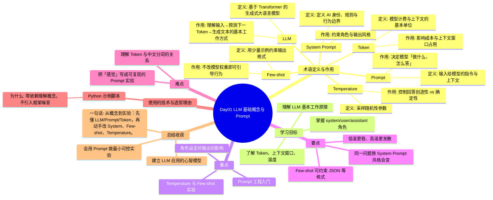

# Day01 思维导图 — LLM 基础概念与 Prompt

> Sprint：Sprint 1 · 基础链路  ·  对应文档：[docs/Day01.md](../docs/Day01.md)

## 导图（Mermaid）

在支持 Mermaid 的编辑器（VS Code / GitHub / Typora）中可直接预览。

## 结构化速览

### 术语

| 术语 | 定义/解析 | 作用 |
|------|-----------|------|
| LLM | 基于 Transformer 的生成式大语言模型 | 理解输入→预测下一 Token→生成文本的基本工作方式 |
| Prompt | 输入给模型的指令与上下文 | 决定模型「做什么、怎么答」 |
| System Prompt | 定义 AI 身份、规则与行为边界 | 约束角色与输出风格 |
| Token | 模型计费与上下文的基本单位 | 影响成本与上下文窗口占用 |
| Temperature | 采样随机性参数 | 控制回答创造性 vs 确定性 |
| Few-shot | 用少量示例约束输出格式 | 不改模型权重即可引导行为 |

### 学习目标

- 理解 LLM 基本工作原理
- 掌握 system/user/assistant 角色
- 了解 Token、上下文窗口、温度

### 重点

- Prompt 工程入门
- 角色设定对输出的影响
- Temperature 与 Few-shot 实验

### 要点

- 同一问题换 System Prompt 风格会变
- Few-shot 可约束 JSON 等格式
- 低温更稳、高温更发散

### 难点

- 把「感觉」写成可复现的 Prompt 实验
- 理解 Token 与中文分词的关系

### 技术与为什么用

- **Python 示例脚本**：零依赖理解概念，不引入框架噪音

### 总结收获

- 建立 LLM 应用的心智模型
- 会用 Prompt 做最小可控实验

**一句话：** 从概念到实验：先懂 LLM/Prompt/Token，再动手改 System、Few-shot、Temperature。
