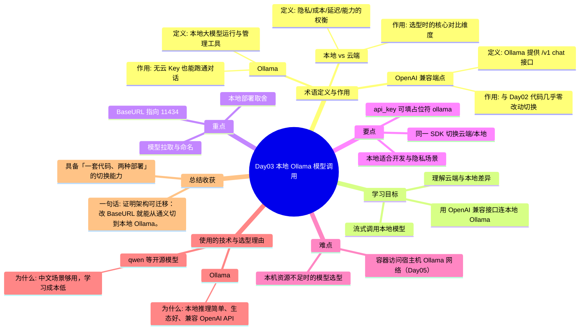

# Day03 思维导图 — 本地 Ollama 模型调用

> Sprint：Sprint 1 · 基础链路  ·  对应文档：[docs/Day03.md](../docs/Day03.md)

## 导图（Mermaid）

在支持 Mermaid 的编辑器（VS Code / GitHub / Typora）中可直接预览。

## 结构化速览

### 术语

| 术语 | 定义/解析 | 作用 |
|------|-----------|------|
| Ollama | 本地大模型运行与管理工具 | 无云 Key 也能跑通对话 |
| OpenAI 兼容端点 | Ollama 提供 /v1 chat 接口 | 与 Day02 代码几乎零改动切换 |
| 本地 vs 云端 | 隐私/成本/延迟/能力的权衡 | 选型时的核心对比维度 |

### 学习目标

- 用 OpenAI 兼容接口连本地 Ollama
- 流式调用本地模型
- 理解云端与本地差异

### 重点

- BaseURL 指向 11434
- 模型拉取与命名
- 本地部署取舍

### 要点

- api_key 可填占位符 ollama
- 同一 SDK 切换云端/本地
- 本地适合开发与隐私场景

### 难点

- 本机资源不足时的模型选型
- 容器访问宿主机 Ollama 网络（Day05）

### 技术与为什么用

- **Ollama**：本地推理简单、生态好、兼容 OpenAI API
- **qwen 等开源模型**：中文场景够用，学习成本低

### 总结收获

- 具备「一套代码、两种部署」的切换能力

**一句话：** 证明架构可迁移：改 BaseURL 就能从通义切到本地 Ollama。
