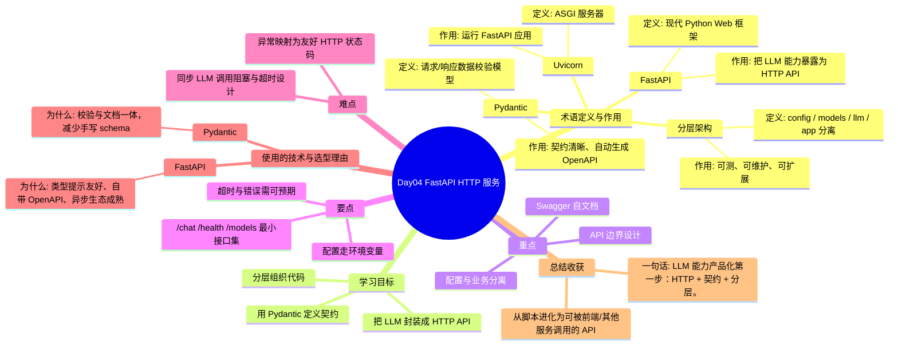

# Day04 思维导图 — FastAPI HTTP 服务

> Sprint：Sprint 1 · 基础链路  ·  对应文档：[docs/Day04.md](../docs/Day04.md)

## 导图（Mermaid）

在支持 Mermaid 的编辑器（VS Code / GitHub / Typora）中可直接预览。

## 结构化速览

### 术语

| 术语 | 定义/解析 | 作用 |
|------|-----------|------|
| FastAPI | 现代 Python Web 框架 | 把 LLM 能力暴露为 HTTP API |
| Pydantic | 请求/响应数据校验模型 | 契约清晰、自动生成 OpenAPI |
| 分层架构 | config / models / llm / app 分离 | 可测、可维护、可扩展 |
| Uvicorn | ASGI 服务器 | 运行 FastAPI 应用 |

### 学习目标

- 把 LLM 封装成 HTTP API
- 用 Pydantic 定义契约
- 分层组织代码

### 重点

- API 边界设计
- 配置与业务分离
- Swagger 自文档

### 要点

- /chat /health /models 最小接口集
- 超时与错误需可预期
- 配置走环境变量

### 难点

- 同步 LLM 调用阻塞与超时设计
- 异常映射为友好 HTTP 状态码

### 技术与为什么用

- **FastAPI**：类型提示友好、自带 OpenAPI、异步生态成熟
- **Pydantic**：校验与文档一体，减少手写 schema

### 总结收获

- 从脚本进化为可被前端/其他服务调用的 API

**一句话：** LLM 能力产品化第一步：HTTP + 契约 + 分层。
