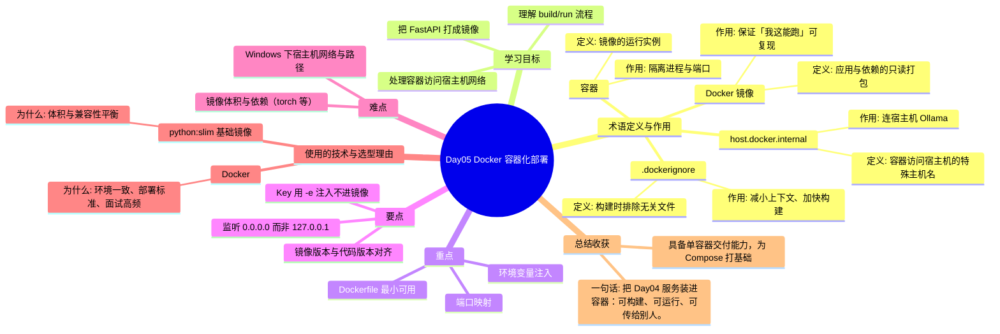

# Day05 思维导图 — Docker 容器化部署

> Sprint：Sprint 1 · 基础链路  ·  对应文档：[docs/Day05.md](../docs/Day05.md)

## 导图（Mermaid）

在支持 Mermaid 的编辑器（VS Code / GitHub / Typora）中可直接预览。

## 结构化速览

### 术语

| 术语 | 定义/解析 | 作用 |
|------|-----------|------|
| Docker 镜像 | 应用与依赖的只读打包 | 保证「我这能跑」可复现 |
| 容器 | 镜像的运行实例 | 隔离进程与端口 |
| host.docker.internal | 容器访问宿主机的特殊主机名 | 连宿主机 Ollama |
| .dockerignore | 构建时排除无关文件 | 减小上下文、加快构建 |

### 学习目标

- 把 FastAPI 打成镜像
- 理解 build/run 流程
- 处理容器访问宿主机网络

### 重点

- Dockerfile 最小可用
- 端口映射
- 环境变量注入

### 要点

- 监听 0.0.0.0 而非 127.0.0.1
- Key 用 -e 注入不进镜像
- 镜像版本与代码版本对齐

### 难点

- Windows 下宿主机网络与路径
- 镜像体积与依赖（torch 等）

### 技术与为什么用

- **Docker**：环境一致、部署标准、面试高频
- **python:slim 基础镜像**：体积与兼容性平衡

### 总结收获

- 具备单容器交付能力，为 Compose 打基础

**一句话：** 把 Day04 服务装进容器：可构建、可运行、可传给别人。
