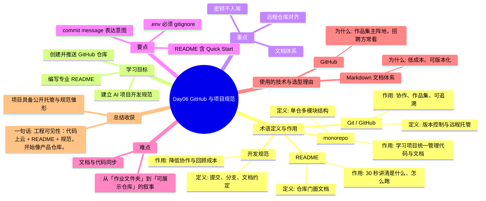

# Day06 思维导图 — GitHub 与项目规范

> Sprint：Sprint 1 · 基础链路  ·  对应文档：[docs/Day06.md](../docs/Day06.md)

## 导图（Mermaid）

在支持 Mermaid 的编辑器（VS Code / GitHub / Typora）中可直接预览。

## 结构化速览

### 术语

| 术语 | 定义/解析 | 作用 |
|------|-----------|------|
| Git / GitHub | 版本控制与远程托管 | 协作、作品集、可追溯 |
| README | 仓库门面文档 | 30 秒讲清是什么、怎么跑 |
| 开发规范 | 提交、分支、文档约定 | 降低协作与回顾成本 |
| monorepo | 单仓多模块结构 | 学习项目统一管理代码与文档 |

### 学习目标

- 创建并推送 GitHub 仓库
- 编写专业 README
- 建立 AI 项目开发规范

### 重点

- 远程仓库对齐
- 文档体系
- 密钥不入库

### 要点

- .env 必须 gitignore
- README 含 Quick Start
- commit message 表达意图

### 难点

- 从「作业文件夹」到「可展示仓库」的叙事
- 文档与代码同步

### 技术与为什么用

- **GitHub**：作品集主阵地，招聘方常看
- **Markdown 文档体系**：低成本、可版本化

### 总结收获

- 项目具备公开托管与规范雏形

**一句话：** 工程可见性：代码上云 + README + 规范，开始像产品仓库。
