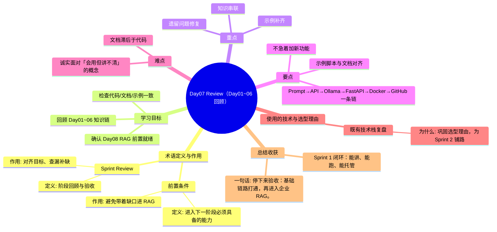

# Day07 思维导图 — Review（Day01~06 回顾）

> Sprint：Sprint 1 · 基础链路  ·  对应文档：[docs/Day07.md](../docs/Day07.md)

## 导图（Mermaid）

在支持 Mermaid 的编辑器（VS Code / GitHub / Typora）中可直接预览。

## 结构化速览

### 术语

| 术语 | 定义/解析 | 作用 |
|------|-----------|------|
| Sprint Review | 阶段回顾与验收 | 对齐目标、查漏补缺 |
| 前置条件 | 进入下一阶段必须具备的能力 | 避免带着缺口进 RAG |

### 学习目标

- 回顾 Day01~06 知识链
- 检查代码/文档/示例一致
- 确认 Day08 RAG 前置就绪

### 重点

- 知识串联
- 遗留问题修复
- 示例补齐

### 要点

- Prompt→API→Ollama→FastAPI→Docker→GitHub 一条链
- 示例脚本与文档对齐
- 不急着加新功能

### 难点

- 诚实面对「会用但讲不清」的概念
- 文档滞后于代码

### 技术与为什么用

- **既有技术栈复盘**：巩固选型理由，为 Sprint 2 铺路

### 总结收获

- Sprint 1 闭环：能讲、能跑、能托管

**一句话：** 停下来验收：基础链路打通，再进入企业 RAG。
