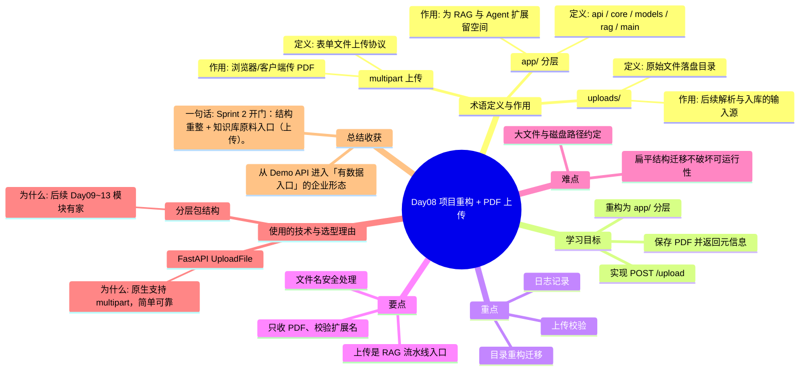

# Day08 思维导图 — 项目重构 + PDF 上传

> Sprint：Sprint 2 · Enterprise RAG  ·  对应文档：[docs/Day08.md](../docs/Day08.md)

## 导图（Mermaid）

在支持 Mermaid 的编辑器（VS Code / GitHub / Typora）中可直接预览。

## 结构化速览

### 术语

| 术语 | 定义/解析 | 作用 |
|------|-----------|------|
| app/ 分层 | api / core / models / rag / main | 为 RAG 与 Agent 扩展留空间 |
| multipart 上传 | 表单文件上传协议 | 浏览器/客户端传 PDF |
| uploads/ | 原始文件落盘目录 | 后续解析与入库的输入源 |

### 学习目标

- 重构为 app/ 分层
- 实现 POST /upload
- 保存 PDF 并返回元信息

### 重点

- 目录重构迁移
- 上传校验
- 日志记录

### 要点

- 只收 PDF、校验扩展名
- 文件名安全处理
- 上传是 RAG 流水线入口

### 难点

- 扁平结构迁移不破坏可运行性
- 大文件与磁盘路径约定

### 技术与为什么用

- **FastAPI UploadFile**：原生支持 multipart，简单可靠
- **分层包结构**：后续 Day09~13 模块有家

### 总结收获

- 从 Demo API 进入「有数据入口」的企业形态

**一句话：** Sprint 2 开门：结构重整 + 知识库原料入口（上传）。
