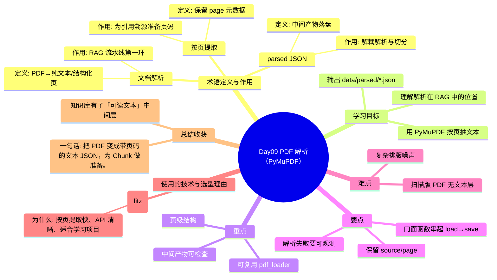

# Day09 思维导图 — PDF 解析（PyMuPDF）

> Sprint：Sprint 2 · Enterprise RAG  ·  对应文档：[docs/Day09.md](../docs/Day09.md)

## 导图（Mermaid）

在支持 Mermaid 的编辑器（VS Code / GitHub / Typora）中可直接预览。

## 结构化速览

### 术语

| 术语 | 定义/解析 | 作用 |
|------|-----------|------|
| 文档解析 | PDF→纯文本/结构化页 | RAG 流水线第一环 |
| 按页提取 | 保留 page 元数据 | 为引用溯源准备页码 |
| parsed JSON | 中间产物落盘 | 解耦解析与切分 |

### 学习目标

- 理解解析在 RAG 中的位置
- 用 PyMuPDF 按页抽文本
- 输出 data/parsed/*.json

### 重点

- 页级结构
- 可复用 pdf_loader
- 中间产物可检查

### 要点

- 解析失败要可观测
- 保留 source/page
- 门面函数串起 load→save

### 难点

- 扫描版 PDF 无文本层
- 复杂排版噪声

### 技术与为什么用

- **PyMuPDF (fitz)**：按页提取快、API 清晰、适合学习项目

### 总结收获

- 知识库有了「可读文本」中间层

**一句话：** 把 PDF 变成带页码的文本 JSON，为 Chunk 做准备。
