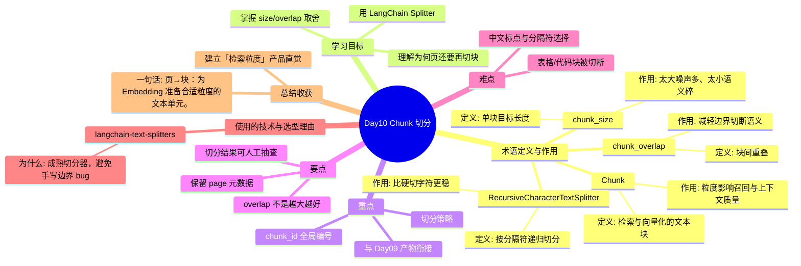

# Day10 思维导图 — Chunk 切分

> Sprint：Sprint 2 · Enterprise RAG  ·  对应文档：[docs/Day10.md](../docs/Day10.md)

## 导图（Mermaid）

在支持 Mermaid 的编辑器（VS Code / GitHub / Typora）中可直接预览。

## 结构化速览

### 术语

| 术语 | 定义/解析 | 作用 |
|------|-----------|------|
| Chunk | 检索与向量化的文本块 | 粒度影响召回与上下文质量 |
| chunk_size | 单块目标长度 | 太大噪声多、太小语义碎 |
| chunk_overlap | 块间重叠 | 减轻边界切断语义 |
| RecursiveCharacterTextSplitter | 按分隔符递归切分 | 比硬切字符更稳 |

### 学习目标

- 理解为何页还要再切块
- 用 LangChain Splitter
- 掌握 size/overlap 取舍

### 重点

- 切分策略
- chunk_id 全局编号
- 与 Day09 产物衔接

### 要点

- overlap 不是越大越好
- 保留 page 元数据
- 切分结果可人工抽查

### 难点

- 中文标点与分隔符选择
- 表格/代码块被切断

### 技术与为什么用

- **langchain-text-splitters**：成熟切分器，避免手写边界 bug

### 总结收获

- 建立「检索粒度」产品直觉

**一句话：** 页→块：为 Embedding 准备合适粒度的文本单元。
