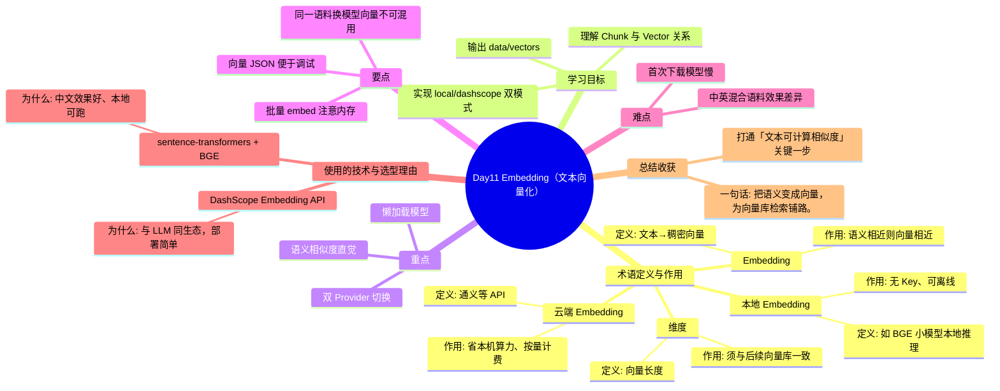

# Day11 思维导图 — Embedding（文本向量化）

> Sprint：Sprint 2 · Enterprise RAG  ·  对应文档：[docs/Day11.md](../docs/Day11.md)

## 导图（Mermaid）

在支持 Mermaid 的编辑器（VS Code / GitHub / Typora）中可直接预览。

## 结构化速览

### 术语

| 术语 | 定义/解析 | 作用 |
|------|-----------|------|
| Embedding | 文本→稠密向量 | 语义相近则向量相近 |
| 本地 Embedding | 如 BGE 小模型本地推理 | 无 Key、可离线 |
| 云端 Embedding | 通义等 API | 省本机算力、按量计费 |
| 维度 | 向量长度 | 须与后续向量库一致 |

### 学习目标

- 理解 Chunk 与 Vector 关系
- 实现 local/dashscope 双模式
- 输出 data/vectors

### 重点

- 语义相似度直觉
- 双 Provider 切换
- 懒加载模型

### 要点

- 同一语料换模型向量不可混用
- 批量 embed 注意内存
- 向量 JSON 便于调试

### 难点

- 首次下载模型慢
- 中英混合语料效果差异

### 技术与为什么用

- **sentence-transformers + BGE**：中文效果好、本地可跑
- **DashScope Embedding API**：与 LLM 同生态，部署简单

### 总结收获

- 打通「文本可计算相似度」关键一步

**一句话：** 把语义变成向量，为向量库检索铺路。
