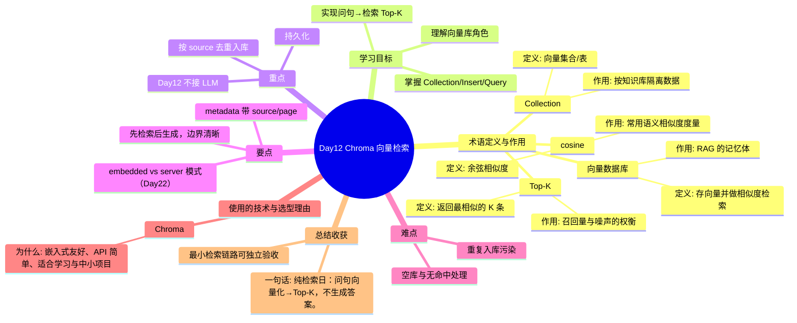

# Day12 思维导图 — Chroma 向量检索

> Sprint：Sprint 2 · Enterprise RAG  ·  对应文档：[docs/Day12.md](../docs/Day12.md)

## 导图（Mermaid）

在支持 Mermaid 的编辑器（VS Code / GitHub / Typora）中可直接预览。

## 结构化速览

### 术语

| 术语 | 定义/解析 | 作用 |
|------|-----------|------|
| 向量数据库 | 存向量并做相似度检索 | RAG 的记忆体 |
| Collection | 向量集合/表 | 按知识库隔离数据 |
| Top-K | 返回最相似的 K 条 | 召回量与噪声的权衡 |
| cosine | 余弦相似度 | 常用语义相似度度量 |

### 学习目标

- 理解向量库角色
- 掌握 Collection/Insert/Query
- 实现问句→检索 Top-K

### 重点

- 持久化
- 按 source 去重入库
- Day12 不接 LLM

### 要点

- 先检索后生成，边界清晰
- metadata 带 source/page
- embedded vs server 模式（Day22）

### 难点

- 重复入库污染
- 空库与无命中处理

### 技术与为什么用

- **Chroma**：嵌入式友好、API 简单、适合学习与中小项目

### 总结收获

- 最小检索链路可独立验收

**一句话：** 纯检索日：问句向量化→Top-K，不生成答案。
