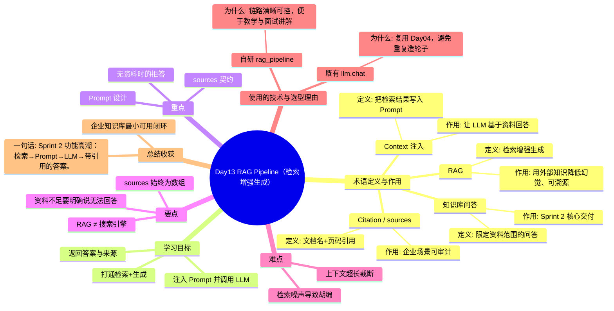

# Day13 思维导图 — RAG Pipeline（检索增强生成）

> Sprint：Sprint 2 · Enterprise RAG  ·  对应文档：[docs/Day13.md](../docs/Day13.md)

## 导图（Mermaid）

在支持 Mermaid 的编辑器（VS Code / GitHub / Typora）中可直接预览。

## 结构化速览

### 术语

| 术语 | 定义/解析 | 作用 |
|------|-----------|------|
| RAG | 检索增强生成 | 用外部知识降低幻觉、可溯源 |
| Context 注入 | 把检索结果写入 Prompt | 让 LLM 基于资料回答 |
| Citation / sources | 文档名+页码引用 | 企业场景可审计 |
| 知识库问答 | 限定资料范围的问答 | Sprint 2 核心交付 |

### 学习目标

- 打通检索+生成
- 注入 Prompt 并调用 LLM
- 返回答案与来源

### 重点

- Prompt 设计
- 无资料时的拒答
- sources 契约

### 要点

- 资料不足要明确说无法回答
- sources 始终为数组
- RAG ≠ 搜索引擎

### 难点

- 检索噪声导致胡编
- 上下文超长截断

### 技术与为什么用

- **自研 rag_pipeline**：链路清晰可控，便于教学与面试讲解
- **既有 llm.chat**：复用 Day04，避免重复造轮子

### 总结收获

- 企业知识库最小可用闭环

**一句话：** Sprint 2 功能高潮：检索→Prompt→LLM→带引用的答案。
