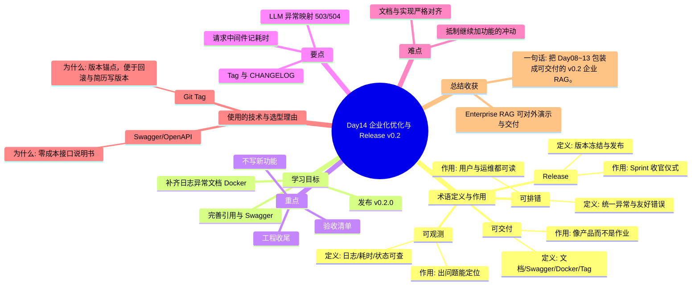

# Day14 思维导图 — 企业化优化与 Release v0.2

> Sprint：Sprint 2 · Enterprise RAG  ·  对应文档：[docs/Day14.md](../docs/Day14.md)

## 导图（Mermaid）

在支持 Mermaid 的编辑器（VS Code / GitHub / Typora）中可直接预览。

## 结构化速览

### 术语

| 术语 | 定义/解析 | 作用 |
|------|-----------|------|
| 可观测 | 日志/耗时/状态可查 | 出问题能定位 |
| 可排错 | 统一异常与友好错误 | 用户与运维都可读 |
| 可交付 | 文档/Swagger/Docker/Tag | 像产品而不是作业 |
| Release | 版本冻结与发布 | Sprint 收官仪式 |

### 学习目标

- 补齐日志异常文档 Docker
- 完善引用与 Swagger
- 发布 v0.2.0

### 重点

- 不写新功能
- 工程收尾
- 验收清单

### 要点

- 请求中间件记耗时
- LLM 异常映射 503/504
- Tag 与 CHANGELOG

### 难点

- 抵制继续加功能的冲动
- 文档与实现严格对齐

### 技术与为什么用

- **Swagger/OpenAPI**：零成本接口说明书
- **Git Tag**：版本锚点，便于回滚与简历写版本

### 总结收获

- Enterprise RAG 可对外演示与交付

**一句话：** 把 Day08~13 包装成可交付的 v0.2 企业 RAG。
