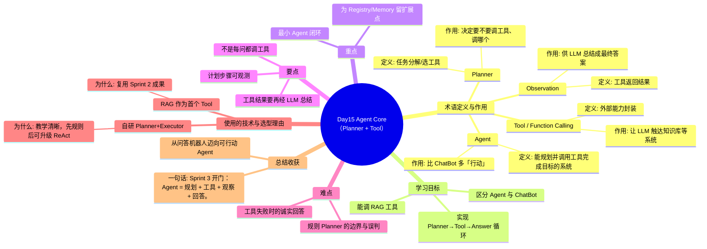

# Day15 思维导图 — Agent Core（Planner + Tool）

> Sprint：Sprint 3 · Enterprise AI Agent  ·  对应文档：[docs/Day15.md](../docs/Day15.md)

## 导图（Mermaid）

在支持 Mermaid 的编辑器（VS Code / GitHub / Typora）中可直接预览。

## 结构化速览

### 术语

| 术语 | 定义/解析 | 作用 |
|------|-----------|------|
| Agent | 能规划并调用工具完成目标的系统 | 比 ChatBot 多「行动」 |
| Planner | 任务分解/选工具 | 决定要不要调工具、调哪个 |
| Tool / Function Calling | 外部能力封装 | 让 LLM 触达知识库等系统 |
| Observation | 工具返回结果 | 供 LLM 总结成最终答案 |

### 学习目标

- 区分 Agent 与 ChatBot
- 实现 Planner→Tool→Answer 循环
- 能调 RAG 工具

### 重点

- 最小 Agent 闭环
- 为 Registry/Memory 留扩展点

### 要点

- 不是每问都调工具
- 工具结果要再经 LLM 总结
- 计划步骤可观测

### 难点

- 规则 Planner 的边界与误判
- 工具失败时的诚实回答

### 技术与为什么用

- **自研 Planner+Executor**：教学清晰，先规则后可升级 ReAct
- **RAG 作为首个 Tool**：复用 Sprint 2 成果

### 总结收获

- 从问答机器人迈向可行动 Agent

**一句话：** Sprint 3 开门：Agent = 规划 + 工具 + 观察 + 回答。
