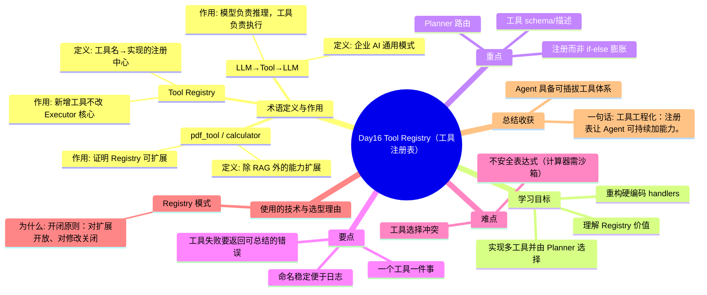

# Day16 思维导图 — Tool Registry（工具注册表）

> Sprint：Sprint 3 · Enterprise AI Agent  ·  对应文档：[docs/Day16.md](../docs/Day16.md)

## 导图（Mermaid）

在支持 Mermaid 的编辑器（VS Code / GitHub / Typora）中可直接预览。

## 结构化速览

### 术语

| 术语 | 定义/解析 | 作用 |
|------|-----------|------|
| Tool Registry | 工具名→实现的注册中心 | 新增工具不改 Executor 核心 |
| LLM→Tool→LLM | 企业 AI 通用模式 | 模型负责推理，工具负责执行 |
| pdf_tool / calculator | 除 RAG 外的能力扩展 | 证明 Registry 可扩展 |

### 学习目标

- 理解 Registry 价值
- 重构硬编码 handlers
- 实现多工具并由 Planner 选择

### 重点

- 注册而非 if-else 膨胀
- 工具 schema/描述
- Planner 路由

### 要点

- 工具失败要返回可总结的错误
- 命名稳定便于日志
- 一个工具一件事

### 难点

- 工具选择冲突
- 不安全表达式（计算器需沙箱）

### 技术与为什么用

- **Registry 模式**：开闭原则：对扩展开放、对修改关闭

### 总结收获

- Agent 具备可插拔工具体系

**一句话：** 工具工程化：注册表让 Agent 可持续加能力。
