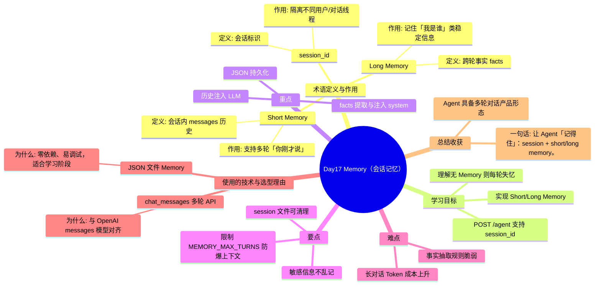

# Day17 思维导图 — Memory（会话记忆）

> Sprint：Sprint 3 · Enterprise AI Agent  ·  对应文档：[docs/Day17.md](../docs/Day17.md)

## 导图（Mermaid）

在支持 Mermaid 的编辑器（VS Code / GitHub / Typora）中可直接预览。

## 结构化速览

### 术语

| 术语 | 定义/解析 | 作用 |
|------|-----------|------|
| Short Memory | 会话内 messages 历史 | 支持多轮「你刚才说」 |
| Long Memory | 跨轮事实 facts | 记住「我是谁」类稳定信息 |
| session_id | 会话标识 | 隔离不同用户/对话线程 |

### 学习目标

- 理解无 Memory 则每轮失忆
- 实现 Short/Long Memory
- POST /agent 支持 session_id

### 重点

- 历史注入 LLM
- facts 提取与注入 system
- JSON 持久化

### 要点

- 限制 MEMORY_MAX_TURNS 防爆上下文
- 敏感信息不乱记
- session 文件可清理

### 难点

- 事实抽取规则脆弱
- 长对话 Token 成本上升

### 技术与为什么用

- **JSON 文件 Memory**：零依赖、易调试，适合学习阶段
- **chat_messages 多轮 API**：与 OpenAI messages 模型对齐

### 总结收获

- Agent 具备多轮对话产品形态

**一句话：** 让 Agent「记得住」：session + short/long memory。
