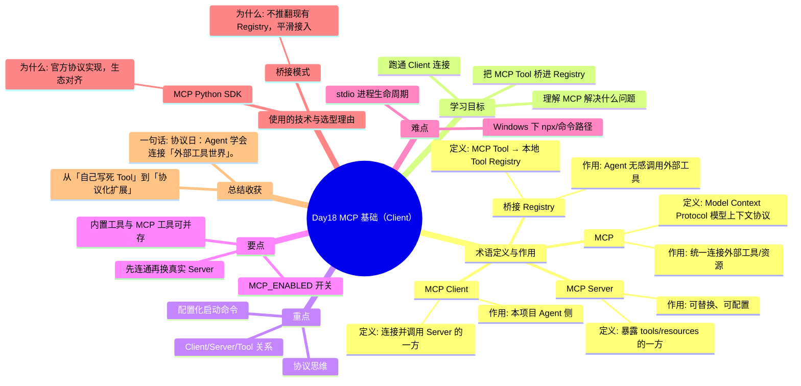

# Day18 思维导图 — MCP 基础（Client）

> Sprint：Sprint 3 · Enterprise AI Agent  ·  对应文档：[docs/Day18.md](../docs/Day18.md)

## 导图（Mermaid）

在支持 Mermaid 的编辑器（VS Code / GitHub / Typora）中可直接预览。

## 结构化速览

### 术语

| 术语 | 定义/解析 | 作用 |
|------|-----------|------|
| MCP | Model Context Protocol 模型上下文协议 | 统一连接外部工具/资源 |
| MCP Client | 连接并调用 Server 的一方 | 本项目 Agent 侧 |
| MCP Server | 暴露 tools/resources 的一方 | 可替换、可配置 |
| 桥接 Registry | MCP Tool → 本地 Tool Registry | Agent 无感调用外部工具 |

### 学习目标

- 理解 MCP 解决什么问题
- 跑通 Client 连接
- 把 MCP Tool 桥进 Registry

### 重点

- 协议思维
- Client/Server/Tool 关系
- 配置化启动命令

### 要点

- 内置工具与 MCP 工具可并存
- MCP_ENABLED 开关
- 先连通再换真实 Server

### 难点

- stdio 进程生命周期
- Windows 下 npx/命令路径

### 技术与为什么用

- **MCP Python SDK**：官方协议实现，生态对齐
- **桥接模式**：不推翻现有 Registry，平滑接入

### 总结收获

- 从「自己写死 Tool」到「协议化扩展」

**一句话：** 协议日：Agent 学会连接「外部工具世界」。
