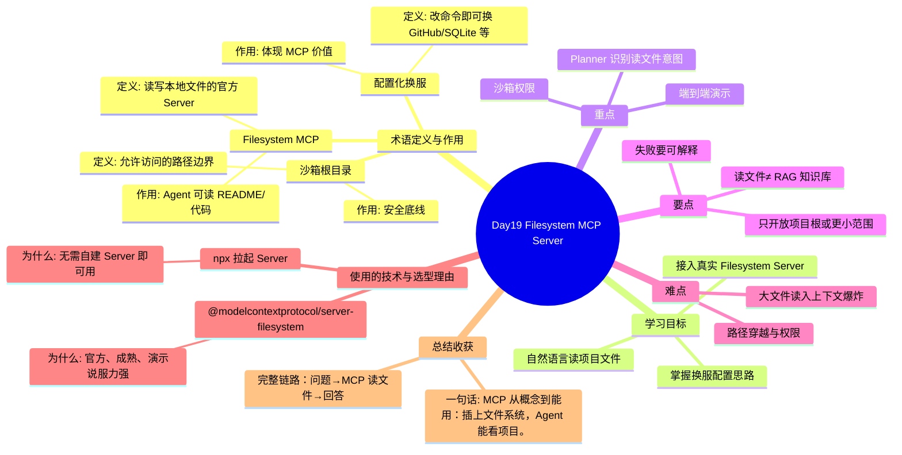

# Day19 思维导图 — Filesystem MCP Server

> Sprint：Sprint 3 · Enterprise AI Agent  ·  对应文档：[docs/Day19.md](../docs/Day19.md)

## 导图（Mermaid）

在支持 Mermaid 的编辑器（VS Code / GitHub / Typora）中可直接预览。

## 结构化速览

### 术语

| 术语 | 定义/解析 | 作用 |
|------|-----------|------|
| Filesystem MCP | 读写本地文件的官方 Server | Agent 可读 README/代码 |
| 沙箱根目录 | 允许访问的路径边界 | 安全底线 |
| 配置化换服 | 改命令即可换 GitHub/SQLite 等 | 体现 MCP 价值 |

### 学习目标

- 接入真实 Filesystem Server
- 自然语言读项目文件
- 掌握换服配置思路

### 重点

- 沙箱权限
- Planner 识别读文件意图
- 端到端演示

### 要点

- 只开放项目根或更小范围
- 读文件≠ RAG 知识库
- 失败要可解释

### 难点

- 路径穿越与权限
- 大文件读入上下文爆炸

### 技术与为什么用

- **@modelcontextprotocol/server-filesystem**：官方、成熟、演示说服力强
- **npx 拉起 Server**：无需自建 Server 即可用

### 总结收获

- 完整链路：问题→MCP 读文件→回答

**一句话：** MCP 从概念到能用：插上文件系统，Agent 能看项目。
