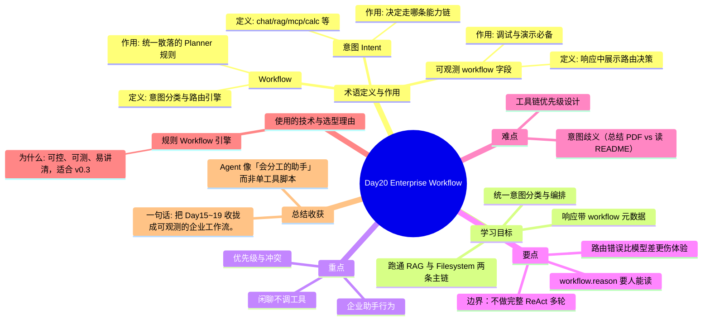

# Day20 思维导图 — Enterprise Workflow

> Sprint：Sprint 3 · Enterprise AI Agent  ·  对应文档：[docs/Day20.md](../docs/Day20.md)

## 导图（Mermaid）

在支持 Mermaid 的编辑器（VS Code / GitHub / Typora）中可直接预览。

## 结构化速览

### 术语

| 术语 | 定义/解析 | 作用 |
|------|-----------|------|
| Workflow | 意图分类与路由引擎 | 统一散落的 Planner 规则 |
| 意图 Intent | chat/rag/mcp/calc 等 | 决定走哪条能力链 |
| 可观测 workflow 字段 | 响应中展示路由决策 | 调试与演示必备 |

### 学习目标

- 统一意图分类与编排
- 跑通 RAG 与 Filesystem 两条主链
- 响应带 workflow 元数据

### 重点

- 优先级与冲突
- 闲聊不调工具
- 企业助手行为

### 要点

- 路由错误比模型差更伤体验
- workflow.reason 要人能读
- 边界：不做完整 ReAct 多轮

### 难点

- 意图歧义（总结 PDF vs 读 README）
- 工具链优先级设计

### 技术与为什么用

- **规则 Workflow 引擎**：可控、可测、易讲清，适合 v0.3

### 总结收获

- Agent 像「会分工的助手」而非单工具脚本

**一句话：** 把 Day15~19 收拢成可观测的企业工作流。
