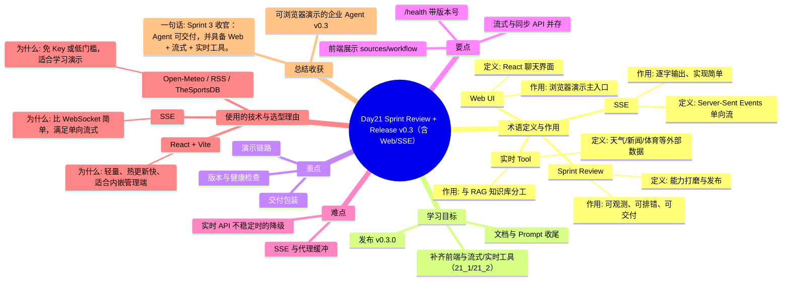

# Day21 思维导图 — Sprint Review + Release v0.3（含 Web/SSE）

> Sprint：Sprint 3 · Enterprise AI Agent  ·  对应文档：[docs/Day21.md](../docs/Day21.md)

## 导图（Mermaid）

在支持 Mermaid 的编辑器（VS Code / GitHub / Typora）中可直接预览。

## 结构化速览

### 术语

| 术语 | 定义/解析 | 作用 |
|------|-----------|------|
| Sprint Review | 能力打磨与发布 | 可观测、可排错、可交付 |
| Web UI | React 聊天界面 | 浏览器演示主入口 |
| SSE | Server-Sent Events 单向流 | 逐字输出、实现简单 |
| 实时 Tool | 天气/新闻/体育等外部数据 | 与 RAG 知识库分工 |

### 学习目标

- 文档与 Prompt 收尾
- 发布 v0.3.0
- 补齐前端与流式/实时工具（21_1/21_2）

### 重点

- 交付包装
- 演示链路
- 版本与健康检查

### 要点

- /health 带版本号
- 前端展示 sources/workflow
- 流式与同步 API 并存

### 难点

- SSE 与代理缓冲
- 实时 API 不稳定时的降级

### 技术与为什么用

- **React + Vite**：轻量、热更新快、适合内嵌管理端
- **SSE**：比 WebSocket 简单，满足单向流式
- **Open-Meteo / RSS / TheSportsDB**：免 Key 或低门槛，适合学习演示

### 总结收获

- 可浏览器演示的企业 Agent v0.3

**一句话：** Sprint 3 收官：Agent 可交付，并具备 Web + 流式 + 实时工具。
