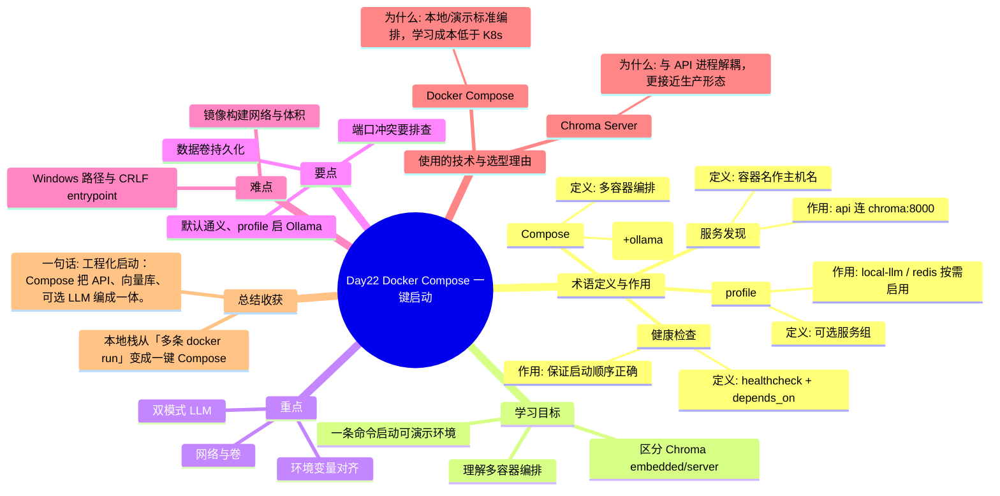

# Day22 思维导图 — Docker Compose 一键启动

> Sprint：Sprint 4 · Engineering  ·  对应文档：[docs/Day22.md](../docs/Day22.md)

## 导图（Mermaid）

在支持 Mermaid 的编辑器（VS Code / GitHub / Typora）中可直接预览。

## 结构化速览

### 术语

| 术语 | 定义/解析 | 作用 |
|------|-----------|------|
| Compose | 多容器编排 | 一键拉起 api+chroma(+ollama) |
| 服务发现 | 容器名作主机名 | api 连 chroma:8000 |
| profile | 可选服务组 | local-llm / redis 按需启用 |
| 健康检查 | healthcheck + depends_on | 保证启动顺序正确 |

### 学习目标

- 理解多容器编排
- 区分 Chroma embedded/server
- 一条命令启动可演示环境

### 重点

- 网络与卷
- 环境变量对齐
- 双模式 LLM

### 要点

- 默认通义、profile 启 Ollama
- 数据卷持久化
- 端口冲突要排查

### 难点

- 镜像构建网络与体积
- Windows 路径与 CRLF entrypoint

### 技术与为什么用

- **Docker Compose**：本地/演示标准编排，学习成本低于 K8s
- **Chroma Server**：与 API 进程解耦，更接近生产形态

### 总结收获

- 本地栈从「多条 docker run」变成一键 Compose

**一句话：** 工程化启动：Compose 把 API、向量库、可选 LLM 编成一体。
