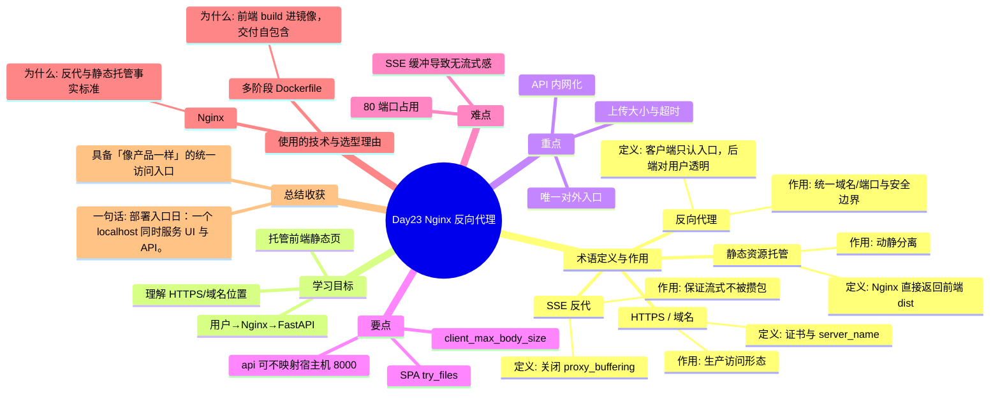

# Day23 思维导图 — Nginx 反向代理

> Sprint：Sprint 4 · Engineering  ·  对应文档：[docs/Day23.md](../docs/Day23.md)

## 导图（Mermaid）

在支持 Mermaid 的编辑器（VS Code / GitHub / Typora）中可直接预览。

## 结构化速览

### 术语

| 术语 | 定义/解析 | 作用 |
|------|-----------|------|
| 反向代理 | 客户端只认入口，后端对用户透明 | 统一域名/端口与安全边界 |
| 静态资源托管 | Nginx 直接返回前端 dist | 动静分离 |
| HTTPS / 域名 | 证书与 server_name | 生产访问形态 |
| SSE 反代 | 关闭 proxy_buffering | 保证流式不被攒包 |

### 学习目标

- 用户→Nginx→FastAPI
- 托管前端静态页
- 理解 HTTPS/域名位置

### 重点

- 唯一对外入口
- API 内网化
- 上传大小与超时

### 要点

- api 可不映射宿主机 8000
- SPA try_files
- client_max_body_size

### 难点

- SSE 缓冲导致无流式感
- 80 端口占用

### 技术与为什么用

- **Nginx**：反代与静态托管事实标准
- **多阶段 Dockerfile**：前端 build 进镜像，交付自包含

### 总结收获

- 具备「像产品一样」的统一访问入口

**一句话：** 部署入口日：一个 localhost 同时服务 UI 与 API。
