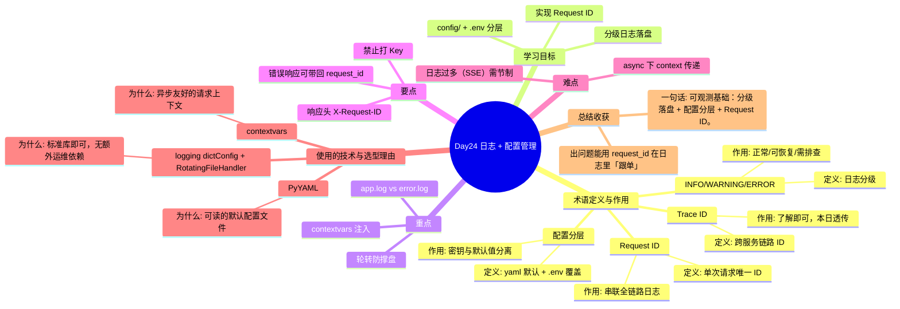

# Day24 思维导图 — 日志 + 配置管理

> Sprint：Sprint 4 · Engineering  ·  对应文档：[docs/Day24.md](../docs/Day24.md)

## 导图（Mermaid）

在支持 Mermaid 的编辑器（VS Code / GitHub / Typora）中可直接预览。

## 结构化速览

### 术语

| 术语 | 定义/解析 | 作用 |
|------|-----------|------|
| INFO/WARNING/ERROR | 日志分级 | 正常/可恢复/需排查 |
| 配置分层 | yaml 默认 + .env 覆盖 | 密钥与默认值分离 |
| Request ID | 单次请求唯一 ID | 串联全链路日志 |
| Trace ID | 跨服务链路 ID | 了解即可，本日透传 |

### 学习目标

- 分级日志落盘
- config/ + .env 分层
- 实现 Request ID

### 重点

- app.log vs error.log
- contextvars 注入
- 轮转防撑盘

### 要点

- 响应头 X-Request-ID
- 错误响应可带回 request_id
- 禁止打 Key

### 难点

- async 下 context 传递
- 日志过多（SSE）需节制

### 技术与为什么用

- **logging dictConfig + RotatingFileHandler**：标准库即可，无额外运维依赖
- **contextvars**：异步友好的请求上下文
- **PyYAML**：可读的默认配置文件

### 总结收获

- 出问题能用 request_id 在日志里「跟单」

**一句话：** 可观测基础：分级落盘 + 配置分层 + Request ID。
