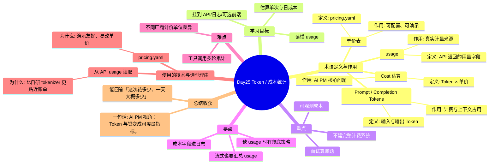

# Day25 思维导图 — Token / 成本统计

> Sprint：Sprint 4 · Engineering  ·  对应文档：[docs/Day25.md](../docs/Day25.md)

## 导图（Mermaid）

在支持 Mermaid 的编辑器（VS Code / GitHub / Typora）中可直接预览。

## 结构化速览

### 术语

| 术语 | 定义/解析 | 作用 |
|------|-----------|------|
| Prompt / Completion Tokens | 输入与输出 Token | 计费与上下文占用 |
| usage | API 返回的用量字段 | 真实计量来源 |
| Cost 估算 | Token × 单价 | AI PM 核心问题 |
| 单价表 | pricing.yaml | 可配置、可演示 |

### 学习目标

- 读懂 usage
- 估算单次与日成本
- 挂到 API/日志/可选前端

### 重点

- 可观测成本
- 面试算账题
- 不建完整计费系统

### 要点

- 流式也要汇总 usage
- 缺 usage 时有兜底策略
- 成本字段进日志

### 难点

- 不同厂商计价单位差异
- 工具调用多轮累计

### 技术与为什么用

- **从 API usage 读取**：比自研 tokenizer 更贴近账单
- **pricing.yaml**：演示友好、易改单价

### 总结收获

- 能回答「这次花多少、一天大概多少」

**一句话：** AI PM 视角：Token 与钱变成可度量指标。
