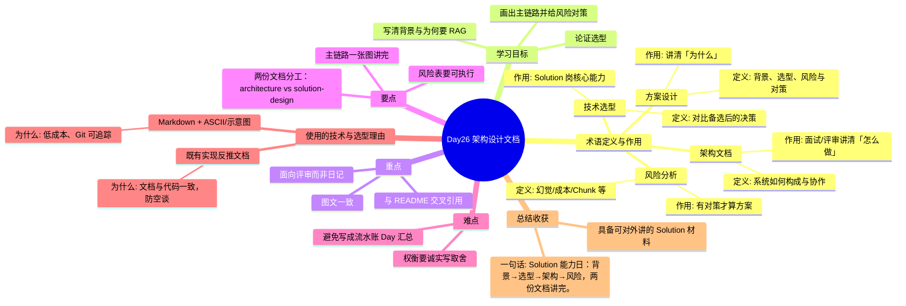

# Day26 思维导图 — 架构设计文档

> Sprint：Sprint 4 · Engineering  ·  对应文档：[docs/Day26.md](../docs/Day26.md)

## 导图（Mermaid）

在支持 Mermaid 的编辑器（VS Code / GitHub / Typora）中可直接预览。

## 结构化速览

### 术语

| 术语 | 定义/解析 | 作用 |
|------|-----------|------|
| 架构文档 | 系统如何构成与协作 | 面试/评审讲清「怎么做」 |
| 方案设计 | 背景、选型、风险与对策 | 讲清「为什么」 |
| 技术选型 | 对比备选后的决策 | Solution 岗核心能力 |
| 风险分析 | 幻觉/成本/Chunk 等 | 有对策才算方案 |

### 学习目标

- 写清背景与为何要 RAG
- 论证选型
- 画出主链路并给风险对策

### 重点

- 面向评审而非日记
- 图文一致
- 与 README 交叉引用

### 要点

- 两份文档分工：architecture vs solution-design
- 主链路一张图讲完
- 风险表要可执行

### 难点

- 避免写成流水账 Day 汇总
- 权衡要诚实写取舍

### 技术与为什么用

- **Markdown + ASCII/示意图**：低成本、Git 可追踪
- **既有实现反推文档**：文档与代码一致，防空谈

### 总结收获

- 具备可对外讲的 Solution 材料

**一句话：** Solution 能力日：背景→选型→架构→风险，两份文档讲完。
