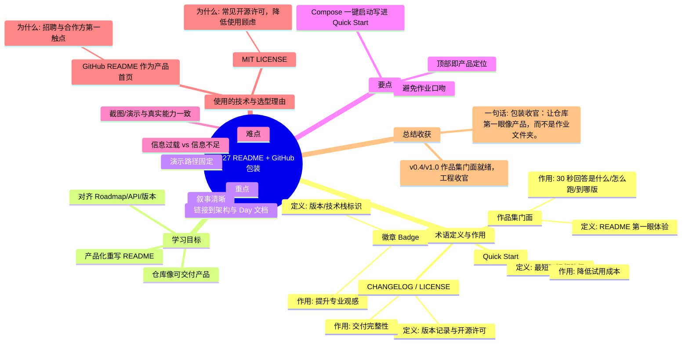

# Day27 思维导图 — README + GitHub 包装

> Sprint：Sprint 4 · Engineering  ·  对应文档：[docs/Day27.md](../docs/Day27.md)

## 导图（Mermaid）

在支持 Mermaid 的编辑器（VS Code / GitHub / Typora）中可直接预览。

## 结构化速览

### 术语

| 术语 | 定义/解析 | 作用 |
|------|-----------|------|
| 作品集门面 | README 第一眼体验 | 30 秒回答是什么/怎么跑/到哪版 |
| Quick Start | 最短可运行路径 | 降低试用成本 |
| 徽章 Badge | 版本/技术栈标识 | 提升专业观感 |
| CHANGELOG / LICENSE | 版本记录与开源许可 | 交付完整性 |

### 学习目标

- 产品化重写 README
- 对齐 Roadmap/API/版本
- 仓库像可交付产品

### 重点

- 叙事清晰
- 链接到架构与 Day 文档
- 演示路径固定

### 要点

- 顶部即产品定位
- Compose 一键启动写进 Quick Start
- 避免作业口吻

### 难点

- 信息过载 vs 信息不足
- 截图/演示与真实能力一致

### 技术与为什么用

- **GitHub README 作为产品首页**：招聘与合作方第一触点
- **MIT LICENSE**：常见开源许可，降低使用顾虑

### 总结收获

- v0.4/v1.0 作品集门面就绪，工程收官

**一句话：** 包装收官：让仓库第一眼像产品，而不是作业文件夹。
